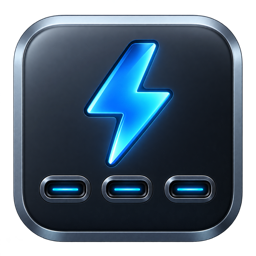
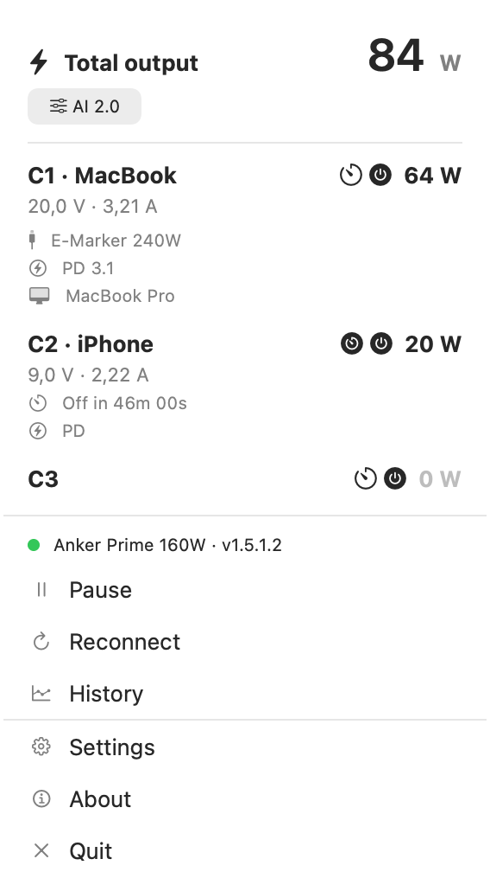
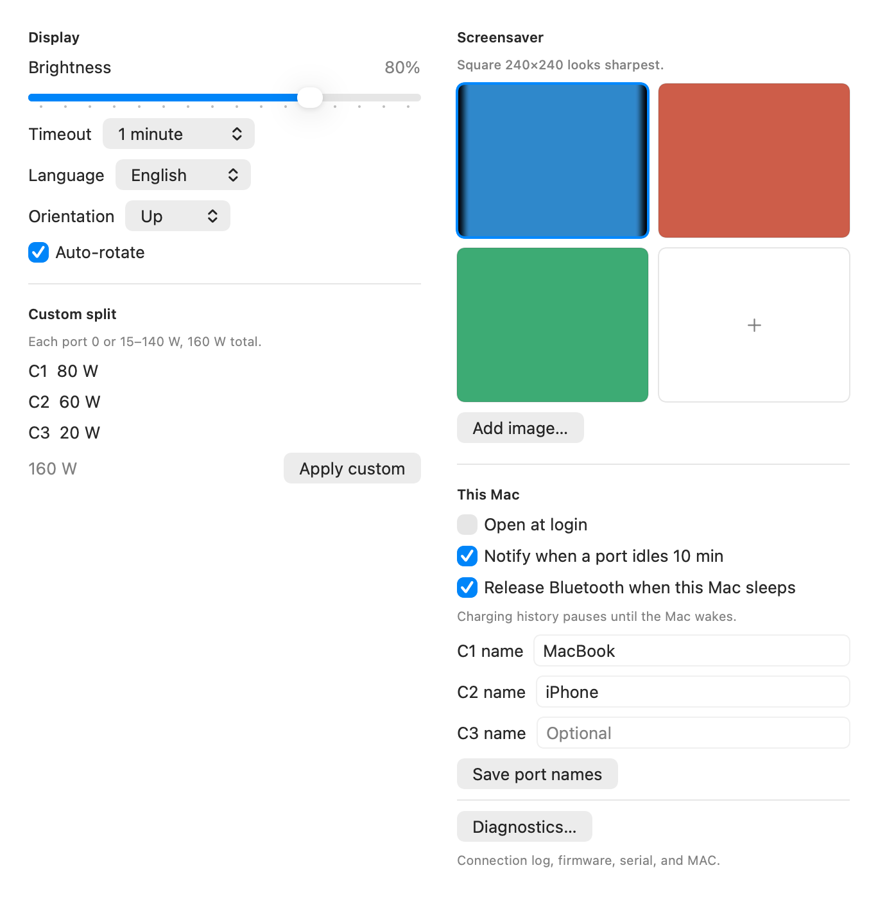
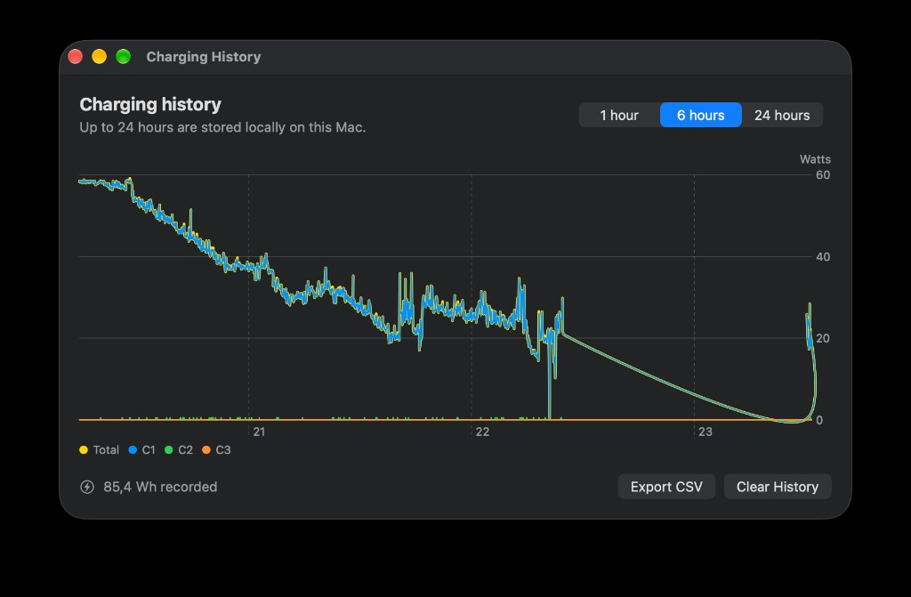
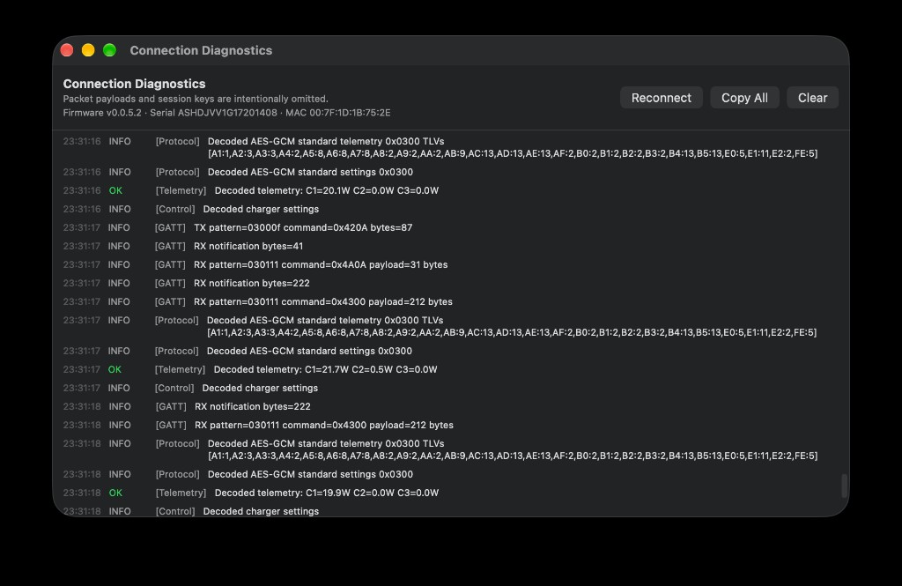

<p align="center">
  
</p>

# Anker Power (ankered)

[](LICENSE)
[](https://github.com/djui/ankered)
[](https://djui.github.io/ankered/)

Unofficial native **macOS menu-bar** monitor for the **Anker Prime Charger 160W with Smart Display (A2687)**. Product page: [djui.github.io/ankered](https://djui.github.io/ankered/).

The app lives in the menu bar (`LSUIElement`). It connects locally over Bluetooth LE, shows live power, and can change charging mode, display settings, and individual USB-C ports. It is not affiliated with Anker Innovations.

<p align="center">
  
</p>

<p>
  
  
</p>

<p>
  
  
</p>

## What's included

- macOS 14+ menu-bar app for **A2687 only**
- Local BLE only — no Anker account, no cloud, no network requests
- Menu-bar title with **total watts** while connected (bolt icon when idle)
- Per-port watts, volts, and amps, plus firmware under the product name
- Charging-mode picker (AI 2.0, C1 Priority, Dual Laptop, Custom) and display settings (brightness, timeout, rotation, language)
- Optional cable / charging / device strings, including a small USB VID/PID table (unknown models stay at brand level)
- Port output on/off, per-port shutdown timers, and optional port nicknames (modern AES-GCM session)
- Rolling 24-hour Mac history, optional charger-side curve, CSV export, and a local watt-hour estimate
- Launch at login, optional idle-port notification, and Shortcuts for port on/off
- Diagnostics window with firmware / serial / MAC in the header (Copy All still omits serials, session keys, and decrypted payloads)
- Current Anker-app-compatible P-256 ECDH / AES-GCM handshake, with AES-CBC fallback from [Anker-BLE](https://github.com/T-REX-XP/Anker-BLE)

## What's not included

- Firmware updates or OTA
- Cloud protocol management (`0x021D`) or Anker account features
- iOS, iPadOS, Windows, Linux
- Home Assistant, MQTT, or any other home-automation bridge
- MagGo pads, power banks, Solix stations, or other Anker models
- The official app's full device-model catalog — unknown USB IDs stay `"Brand Device"`
- Sharing the BLE session with the official Anker app (only one client at a time)
- App Store distribution or Apple notarization (see [Install](#install))

## Requirements

- macOS 14 or newer
- Xcode 15 or newer to build from source
- Anker Prime Charger 160W, model **A2687**
- Bluetooth permission
- The official Anker mobile app disconnected from the charger

## Install

Download `AnkerPower-1.2.1.zip` from the [latest GitHub Release](https://github.com/djui/ankered/releases/latest), unzip it, and move `AnkerPower.app` to `/Applications`.

Builds are ad-hoc signed and **not notarized**. On first launch, right-click the app and choose **Open**, then confirm. After that, Spotlight and Finder open it normally.

Grant Bluetooth access when macOS asks.

## Usage

The app appears only in the menu bar. Click the bolt icon:

- **Connected** — total watts in the menu-bar title; the popover lists C1–C3
- **Charging mode** — AI 2.0, C1 Priority, Dual Laptop, or Custom
- **Settings** — display, custom watt split, port names, launch at login, idle notify
- **Pause** — drop the BLE session and stay in the menu bar so the official Anker app can connect; **Resume** to scan again
- **Reconnect** — drop the current session and scan again
- **Diagnostics** — handshake and protocol log
- **History** — last 1 / 6 / 24 hours on this Mac, charger curve, CSV export
- **Quit**

Right-click the bolt icon for Pause/Resume, Reconnect, Charging History, Diagnostics, and Quit. Shortcuts can turn a port on or off while the app is running.

If a connection fails, open Diagnostics and use **Copy All** when filing an issue.

## Build from source

```sh
open AnkerPower.xcodeproj
```

Select the `AnkerPower` scheme and **My Mac**, then Run.

```sh
xcodebuild -project AnkerPower.xcodeproj -scheme AnkerPower \
  -destination 'platform=macOS' test
```

Cut a local archive (and optionally a GitHub Release) with:

```sh
./scripts/release.sh            # zip only
./scripts/release.sh --publish 1.2.1
```

## Privacy

All charger telemetry and history stay on the Mac. Up to 24 hours of samples and last-known charger identity are stored in the app's Application Support container (`~/Library/Application Support/AnkerPower/`). Port nicknames live in UserDefaults. The app makes no network requests.

## Protocol

This is an unofficial implementation. The A2687 BLE protocol is not a public Anker API and may change with charger firmware.

The app first performs the current app-compatible, ephemeral P-256 ECDH/AES-GCM session and polls `0x020A`/`0x0200`. After the session is ready it also requests charger-side history once (`0x020C`). If that handshake does not answer, it falls back to the older AES-CBC flow and `0x4200` telemetry subscription documented by the MIT-licensed [T-REX-XP/Anker-BLE](https://github.com/T-REX-XP/Anker-BLE) project. Mode, display, port control, and history are available on the modern session only. Charger-button changes arrive as `0x0300`–`0x030B` reports.

## Credits

Protocol constants, FF09 framing, negotiation, ECDH/AES-CBC behavior, and telemetry subscription are derived from:

- **[Anker-BLE](https://github.com/T-REX-XP/Anker-BLE)** — Copyright (c) 2026 T-REX-XP / Anker-BLE contributors, MIT License. Full notice: [THIRD_PARTY_NOTICES.md](THIRD_PARTY_NOTICES.md).

The app-compatible AES-GCM handshake and telemetry commands were cross-checked against public reverse-engineering notes in:

- **[Anker Prime 160W WebBLE (A2687)](https://github.com/Hyper-Beast/Anker_Prime_160W_WebBLE)** — research only; no code or assets from that repository are distributed here.

## License

Ankered is released under the [MIT License](LICENSE). That is compatible with Anker-BLE's MIT license; the required copyright and permission notice is reproduced in [THIRD_PARTY_NOTICES.md](THIRD_PARTY_NOTICES.md).

## Disclaimer

Unofficial research software. **Anker** is a trademark of Anker Innovations. This project is not affiliated with, endorsed by, or sponsored by Anker Innovations. Use at your own risk. Keep the official Anker app disconnected while this app holds the BLE session.
