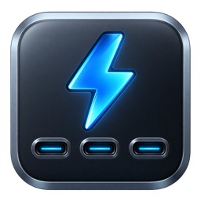
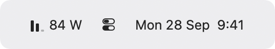
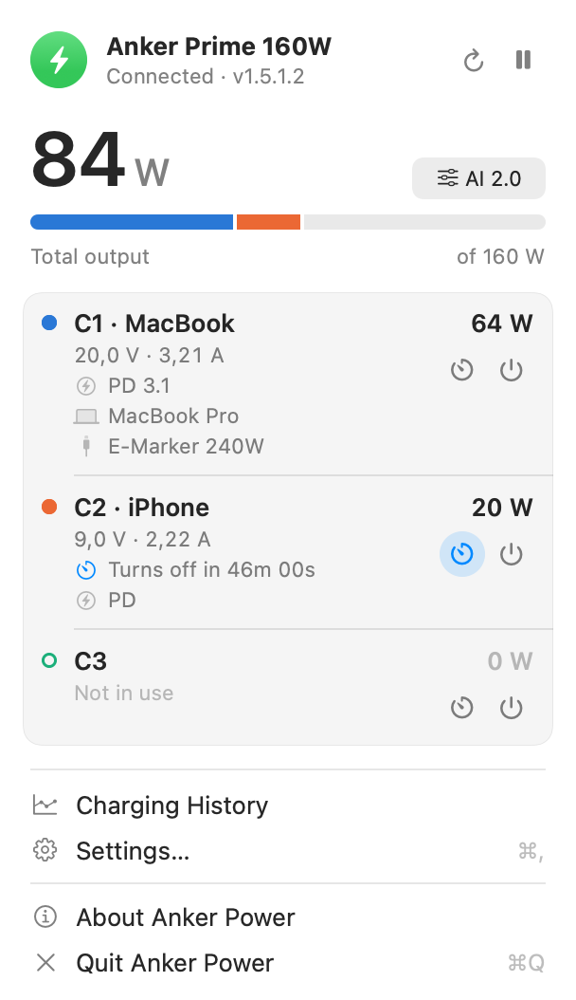
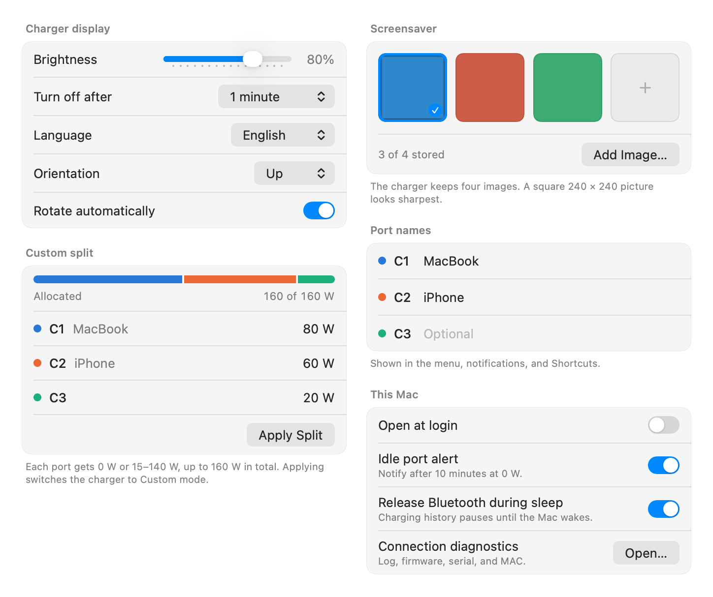
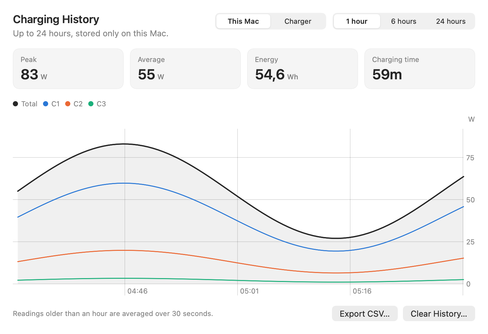
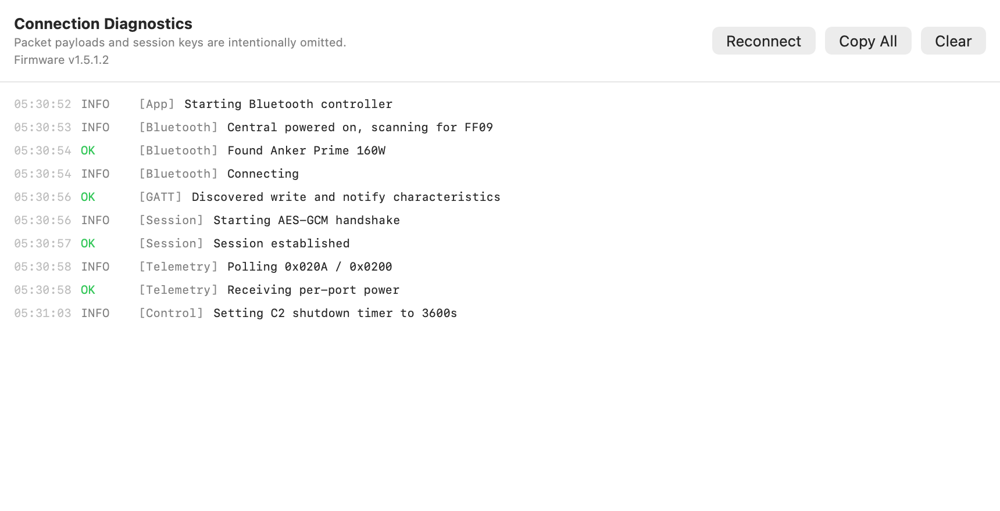
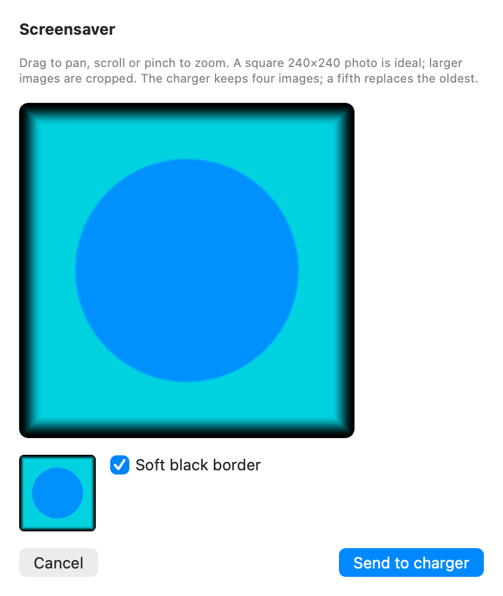

<p align="center">
  
</p>

# Anker Power (ankered)

[](LICENSE)
[](https://github.com/djui/ankered)
[](https://djui.github.io/ankered/)

Unofficial native **macOS menu-bar** monitor for the **Anker Prime Charger 160W with Smart Display (A2687)**. Product page: [djui.github.io/ankered](https://djui.github.io/ankered/).

The app lives in the menu bar (`LSUIElement`). It connects locally over Bluetooth LE, shows live power, and can change charging mode, display settings, and individual USB-C ports. It is not affiliated with Anker Innovations.

<p align="center">
  
</p>

<p>
  <picture>
    <source media="(prefers-color-scheme: dark)" srcset="docs/screenshots/menu-dark.png">
    
  </picture>
  <picture>
    <source media="(prefers-color-scheme: dark)" srcset="docs/screenshots/settings-dark.png">
    
  </picture>
</p>

<p>
  <picture>
    <source media="(prefers-color-scheme: dark)" srcset="docs/screenshots/history-dark.png">
    
  </picture>
  <picture>
    <source media="(prefers-color-scheme: dark)" srcset="docs/screenshots/diagnostics-dark.png">
    
  </picture>
</p>

<p>
  <picture>
    <source media="(prefers-color-scheme: dark)" srcset="docs/screenshots/screensaver-dark.png">
    
  </picture>
</p>

## What's included

- macOS 14+ menu-bar app for **A2687 only**
- Local BLE only — no Anker account, no cloud, no network requests
- Menu-bar title with **total watts** while connected (bolt icon when idle), in tabular digits so it does not jitter
- Popover that leads with the charger's **connection status** and firmware, with Pause and Reconnect beside it; when Bluetooth is off, access is missing, or the charger is out of reach, it says why and offers the fix
- **Total output** against the 160 W limit, with a bar split by port, and the charging-mode picker (AI 2.0, C1 Priority, Dual Laptop, Custom)
- Per-port watts, volts, and amps, with charging protocol, connected device, and cable rating (a small USB VID/PID table; unknown models stay at brand level)
- Port output on/off (with confirmation), per-port shutdown timers, and optional port names (modern AES-GCM session)
- Settings for display (brightness, timeout, language, rotation), a previewed **custom watt split**, port names that save as you type, and This Mac options
- Custom screensaver image over BLE: four local slots, in-app crop, optional black edge blend (no Anker account)
- **24-hour history** on this Mac (full resolution for the last hour, 30-second averages before that) with peak, average, energy, and charging-time tiles, an optional charger-side curve, and CSV export
- Launch at login, optional idle-port notification, and Shortcuts for port on/off
- About panel with app version and homepage link
- Diagnostics window with firmware / serial / MAC in the header (Copy All still omits serials, session keys, and decrypted payloads)
- Current Anker-app-compatible P-256 ECDH / AES-GCM handshake, with AES-CBC fallback from [Anker-BLE](https://github.com/T-REX-XP/Anker-BLE)

## What's not included

- Firmware updates or OTA
- Cloud protocol management (`0x021D`) or Anker account features
- Cloud screensaver catalog, rename, or pictures set only in the official Anker app
- iOS, iPadOS, Windows, Linux
- Home Assistant, MQTT, or any other home-automation bridge
- MagGo pads, power banks, Solix stations, or other Anker models
- The official app's full device-model catalog — unknown USB IDs stay `"Brand Device"`
- Sharing the BLE session with the official Anker app (only one client at a time)
- App Store distribution or Apple notarization (see [Install](#install))

## Requirements

- macOS 14 or newer
- Xcode 15 or newer to build from source
- Anker Prime Charger 160W, model **A2687**
- Bluetooth permission
- The official Anker mobile app disconnected from the charger

## Install

Download `AnkerPower-1.2.6.zip` from the [latest GitHub Release](https://github.com/djui/ankered/releases/latest), unzip it, and move `AnkerPower.app` to `/Applications`.

Builds are ad-hoc signed and **not notarized**. On first launch, right-click the app and choose **Open**, then confirm. After that, Spotlight and Finder open it normally.

Grant Bluetooth access when macOS asks.

## Usage

The app appears only in the menu bar. Click the bolt icon:

- **Header** — charger name, connection status, and firmware. **Reconnect** (↻) drops the session and scans again; **Pause** (⏸) releases the charger so the official Anker app can connect, and **Resume** (▶) takes it back
- **Total output** — live watts against the 160 W limit, a bar split by port, and the **charging mode** (AI 2.0, C1 Priority, Dual Laptop, or Custom)
- **Ports** — C1–C3 with watts, volts, amps, protocol, device, and cable. The timer button sets a 1 / 2 / 3 hour or custom shutdown; the power button turns the output off (after a confirmation) or back on
- **Charging History** — last 1 / 6 / 24 hours on this Mac or the charger's own curve, with peak, average, energy, and charging time; CSV export
- **Settings…** (⌘,) — Charger display, Custom split, Screensaver, Port names, and This Mac (launch at login, idle alert, release Bluetooth during sleep, Connection diagnostics)
- **About Anker Power** and **Quit Anker Power** (⌘Q)

When there is no live data, the popover explains why instead of showing empty ports: searching, paused, Bluetooth off (**Open Bluetooth Settings**), Bluetooth access missing (**Open Privacy Settings**), or connection lost (**Reconnect**).

Right-click the bolt icon for Pause/Resume, Reconnect, Charging History, Settings, About, and Quit. Shortcuts can turn a port on or off while the app is running.

If a connection fails, open **Settings… › Connection diagnostics** and use **Copy All** when filing an issue.

When the charger is away, the app scans in short bursts and waits longer between tries instead of scanning continuously. By default it also disconnects while the Mac sleeps, so charging history has a gap until wake. Turn off **Release Bluetooth during sleep** in Settings to keep the session up.

## Build from source

```sh
open AnkerPower.xcodeproj
```

Select the `AnkerPower` scheme and **My Mac**, then Run. To work on the UI without a charger, add `--demo` to the scheme's launch arguments: the app runs on sample data and never touches Bluetooth.

```sh
xcodebuild -project AnkerPower.xcodeproj -scheme AnkerPower \
  -destination 'platform=macOS' test
```

Refresh the README and landing-page screenshots (light and dark) with:

```sh
./scripts/export-screenshots.sh
```

Cut a local archive (and optionally a GitHub Release) with:

```sh
./scripts/release.sh            # zip only
./scripts/release.sh --publish 1.2.6
```

## Privacy

All charger telemetry and history stay on the Mac. Up to 24 hours of readings (averaged to 30 seconds after the first hour), last-known charger identity, and locally uploaded screensaver JPEGs are stored in the app's Application Support container (`~/Library/Application Support/AnkerPower/`). Port names live in UserDefaults. The app makes no network requests.

## Protocol

This is an unofficial implementation. The A2687 BLE protocol is not a public Anker API and may change with charger firmware.

The app first performs the current app-compatible, ephemeral P-256 ECDH/AES-GCM session and polls `0x020A`/`0x0200`. After the session is ready it also requests charger-side history once (`0x020C`). If that handshake does not answer, it falls back to the older AES-CBC flow and `0x4200` telemetry subscription documented by the MIT-licensed [T-REX-XP/Anker-BLE](https://github.com/T-REX-XP/Anker-BLE) project. Mode, display, port control, screensaver select/upload, and history are available on the modern session only. Charger-button changes arrive as `0x0300`–`0x030B` reports.

## Credits

Protocol constants, FF09 framing, negotiation, ECDH/AES-CBC behavior, and telemetry subscription are derived from:

- **[Anker-BLE](https://github.com/T-REX-XP/Anker-BLE)** — Copyright (c) 2026 T-REX-XP / Anker-BLE contributors, MIT License. Full notice: [THIRD_PARTY_NOTICES.md](THIRD_PARTY_NOTICES.md).

The app-compatible AES-GCM handshake and telemetry commands were cross-checked against public reverse-engineering notes in:

- **[Anker Prime 160W WebBLE (A2687)](https://github.com/Hyper-Beast/Anker_Prime_160W_WebBLE)** — research only; no code or assets from that repository are distributed here.

Screensaver cover-transfer layout (`0x021F` / `0x0220` / `0x0221`, 240×240 JPEG chunks, ACK pacing) was reimplemented from public notes in:

- **[anker-prime-ble](https://github.com/LYJW131/anker-prime-ble)** — research only; no Python or assets from that repository are distributed here.
- **[Charker](https://github.com/qzz0518/Charker)** — Copyright (c) 2026 qzz0518, MIT License. Arithmetic cross-check only; no Swift sources from that repository are distributed here. Full notice: [THIRD_PARTY_NOTICES.md](THIRD_PARTY_NOTICES.md).

## License

Ankered is released under the [MIT License](LICENSE). That is compatible with Anker-BLE's MIT license; the required copyright and permission notice is reproduced in [THIRD_PARTY_NOTICES.md](THIRD_PARTY_NOTICES.md).

## Disclaimer

Unofficial research software. **Anker** is a trademark of Anker Innovations. This project is not affiliated with, endorsed by, or sponsored by Anker Innovations. Use at your own risk. Keep the official Anker app disconnected while this app holds the BLE session.
